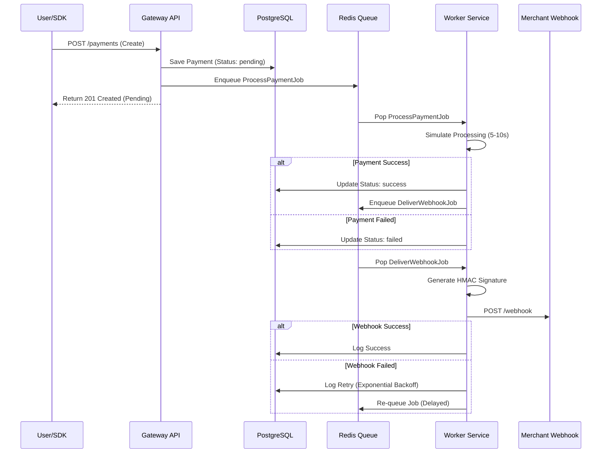

# Async Payment Gateway

A production-ready, asynchronous payment gateway enabling merchants to accept payments via an embeddable SDK. This system implements event-driven architecture using Redis job queues, resilient background workers, and secure HMAC-signed webhooks with exponential backoff retries.

---

## 🏗 Architecture

The system follows an asynchronous, event-driven flow to handle high throughput and reliability.



---

## 🚀 Setup & Running

### Prerequisites

* Docker & Docker Compose

### Start the Application

Run the following command to build and start all services (API, Worker, Redis, Postgres, Dashboard):

```bash
docker-compose up -d --build

```

### Services Overview

| Service | URL / Port | Description |
| --- | --- | --- |
| **API** | `http://localhost:8000` | Core Payment API |
| **Dashboard** | `http://localhost:3000` | Webhook logs & Config |
| **Checkout SDK** | `http://localhost:3001` | Embeddable Widget |
| **Redis** | `Port 6379` | Job Queue |
| **Postgres** | `Port 5432` | Database |

---

## 🔌 API Documentation

### 1. Create Payment

Initiates a payment. Returns `201 Created` immediately with status `pending`.
**POST** `/api/v1/payments`

```bash
curl -X POST http://localhost:8000/api/v1/payments \
  -H "X-Api-Key: key_test_abc123" \
  -H "X-Api-Secret: secret_test_xyz789" \
  -H "Content-Type: application/json" \
  -d '{
    "amount": 50000, 
    "currency": "INR", 
    "method": "upi", 
    "order_id": "ord_test_001",
    "vpa": "test@upi"
  }'

```

### 2. Capture Payment

Captures a successful payment.
**POST** `/api/v1/payments/{id}/capture`

```bash
curl -X POST http://localhost:8000/api/v1/payments/{payment_id}/capture \
  -H "X-Api-Key: key_test_abc123" \
  -H "X-Api-Secret: secret_test_xyz789"

```

### 3. Refund Payment

Initiates a refund for a successful payment.
**POST** `/api/v1/payments/{id}/refunds`

```bash
curl -X POST http://localhost:8000/api/v1/payments/{payment_id}/refunds \
  -H "X-Api-Key: key_test_abc123" \
  -H "X-Api-Secret: secret_test_xyz789" \
  -H "Content-Type: application/json" \
  -d '{ "amount": 1000, "reason": "Customer requested" }'

```

### 4. Job Queue Status (Test Endpoint)

View the status of background jobs.
**GET** `/api/v1/test/jobs/status`

---

## 🔧 Environment Configuration

The system uses the following environment variables (configured in `docker-compose.yml`):

| Variable | Description | Default |
| --- | --- | --- |
| `DATABASE_URL` | JDBC connection string | `jdbc:postgresql://postgres:5432/payment_gateway` |
| `REDIS_URL` | Redis connection string | `redis://redis:6379` |
| `WEBHOOK_RETRY_INTERVALS_TEST` | Enable fast retries for testing | `false` |
| `SPRING_PROFILES_ACTIVE` | Active profile (`default` or `worker`) | `default` |

---

## 📦 SDK Integration Guide

To integrate the payment gateway on a merchant website:

**1. Include the Script:**

```html
<script src="http://localhost:3001/checkout.js"></script>

```

**2. Initialize & Open:**

```javascript
const gateway = new window.PaymentGateway({
  key: 'key_test_abc123',
  orderId: 'ORDER_123',
  onSuccess: (data) => console.log("Payment Success:", data),
  onFailure: (error) => console.error("Payment Failed:", error)
});

// Open the modal
gateway.open();

```

---

## 🔒 Webhook Integration Guide

### 1. Configure Webhook URL

Go to the Dashboard at `http://localhost:3000/webhooks.html` to set your webhook URL and view your secret.

### 2. Verify Signatures

The system sends an `X-Webhook-Signature` header with every request. You must verify this using HMAC-SHA256.

**Node.js Example:**

```javascript
const crypto = require('crypto');

function verifyWebhook(req, secret) {
    const signature = req.headers['x-webhook-signature'];
    const payload = JSON.stringify(req.body); // Must be raw JSON body
    
    const expected = crypto
        .createHmac('sha256', secret)
        .update(payload)
        .digest('hex');

    return signature === expected;
}

```

### 3. Retry Logic

If your server returns a non-200 response, the gateway will retry delivery 5 times using this schedule:

1. **Attempt 1:** Immediate
2. **Attempt 2:** 1 Minute
3. **Attempt 3:** 5 Minutes
4. **Attempt 4:** 30 Minutes
5. **Attempt 5:** 2 Hours

*Note: Enable `WEBHOOK_RETRY_INTERVALS_TEST=true` in docker-compose to use 5-second intervals for testing.*

---

## 🧪 Testing Instructions

1. **Start Services:** Ensure `docker-compose up` is running.
2. **Frontend Test:** * Visit `http://localhost:3001/checkout.html?order_id=TEST_1&key=key_test_abc123`.
* Click "Pay Now".
* Watch the spinner and success message.


3. **Backend Verification:**
* Check worker logs: `docker logs -f gateway_worker`.
* Check dashboard logs: `http://localhost:3000/webhooks.html`.

