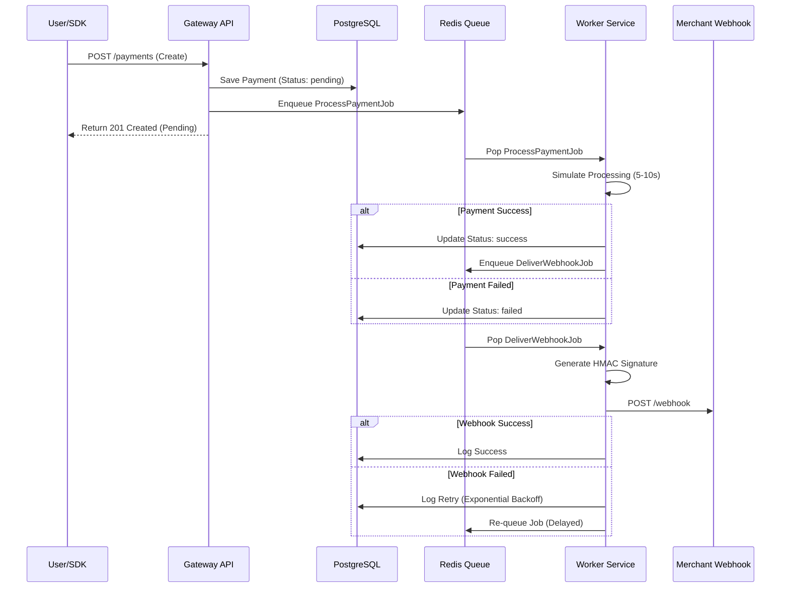

# Async Payment Gateway

A production-ready, asynchronous payment gateway enabling merchants to accept payments via an embeddable SDK. This system implements event-driven architecture using Redis job queues, resilient background workers, and secure HMAC-signed webhooks with exponential backoff retries.

---

## 🏗 Architecture

The system follows an asynchronous, event-driven flow to handle high throughput and reliability.



---

## 🚀 Setup & Running

### Prerequisites

* Docker & Docker Compose

### Start the Application

Run the following command to build and start all services (API, Worker, Redis, Postgres, Dashboard):

```bash
docker-compose up -d --build

```

### 🖥️ Services Overview

| Service | URL / Port | Description |
| --- | --- | --- |
| **Dashboard** | `http://localhost:3000` | **Main Entry Point** (Demo Store, Logs, Docs) |
| **API** | `http://localhost:8000` | Core Payment API |
| **Checkout SDK** | `http://localhost:3001` | Embeddable JS Widget |
| **Redis** | `Port 6379` | Job Queue |
| **Postgres** | `Port 5432` | Database |

---

## 🧪 Testing Instructions (The Easy Way)

We have built a visual Dashboard to make testing easy.

1. **Open the Dashboard:**
Go to `http://localhost:3000`. You should see the status of your workers (Green/Running).
2. **Run a Test Payment:**
* Click on **"Demo Store"** in the navigation bar.
* Click **"Buy Now"**.
* The Checkout Modal will open. Select "UPI" or "Card" and pay.
* Wait ~5 seconds (simulated bank delay).
* You will receive a success alert.


3. **Check Webhooks:**
* Go to the **"Webhooks"** tab.
* You will see the `payment.success` event logged there.
* If it failed, you can click "Retry" to test the retry logic.


---

## 🔌 API Documentation (Manual Testing)

If you prefer using `curl`, here are the endpoints.

### 1. Create Payment

**POST** `/api/v1/payments`

```bash
curl -X POST http://localhost:8000/api/v1/payments \
  -H "X-Api-Key: key_test_abc123" \
  -H "X-Api-Secret: secret_test_xyz789" \
  -H "Content-Type: application/json" \
  -d '{
    "amount": 50000, 
    "currency": "INR", 
    "method": "upi", 
    "order_id": "ord_test_001", 
    "vpa": "test@upi"
  }'

```

### 2. Capture Payment

**POST** `/api/v1/payments/{id}/capture`

```bash
curl -X POST http://localhost:8000/api/v1/payments/{payment_id}/capture \
  -H "X-Api-Key: key_test_abc123" \
  -H "X-Api-Secret: secret_test_xyz789"

```

### 3. Refund Payment

**POST** `/api/v1/payments/{id}/refunds`

```bash
curl -X POST http://localhost:8000/api/v1/payments/{payment_id}/refunds \
  -H "X-Api-Key: key_test_abc123" \
  -H "X-Api-Secret: secret_test_xyz789" \
  -H "Content-Type: application/json" \
  -d '{ "amount": 1000, "reason": "Customer requested" }'

```

### 4. Job Queue Status

**GET** `/api/v1/test/jobs/status`

```bash
curl http://localhost:8000/api/v1/test/jobs/status

```

---

## 🔧 Configuration

The system uses the following environment variables (configured in `docker-compose.yml`):

| Variable | Description | Default |
| --- | --- | --- |
| `DATABASE_URL` | JDBC connection string | `jdbc:postgresql://postgres:5432/payment_gateway` |
| `REDIS_URL` | Redis connection string | `redis://redis:6379` |
| `WEBHOOK_RETRY_INTERVALS_TEST` | Enable fast retries for testing | `false` |
| `SPRING_PROFILES_ACTIVE` | Active profile (`default` or `worker`) | `default` |

---

## 📦 SDK Integration

To integrate the payment gateway on a merchant website:

**1. Include the Script:**

```html
<script src="http://localhost:3001/checkout.js"></script>

```

**2. Initialize & Open:**

```javascript
const gateway = new window.PaymentGateway({
  key: 'key_test_abc123',
  orderId: 'ORDER_123',
  onSuccess: (data) => console.log("Payment Success:", data),
  onFailure: (error) => console.error("Payment Failed:", error)
});

// Open the modal
gateway.open();

```

